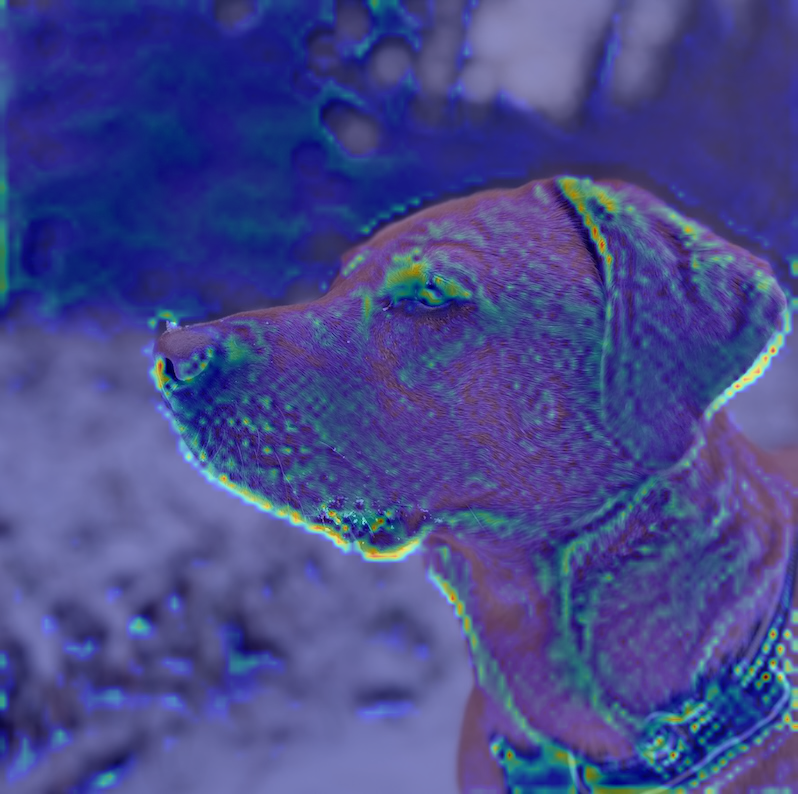
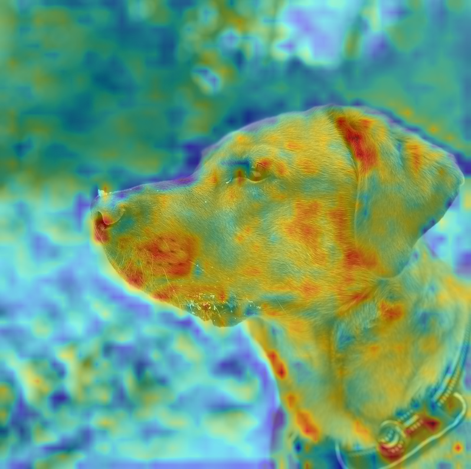
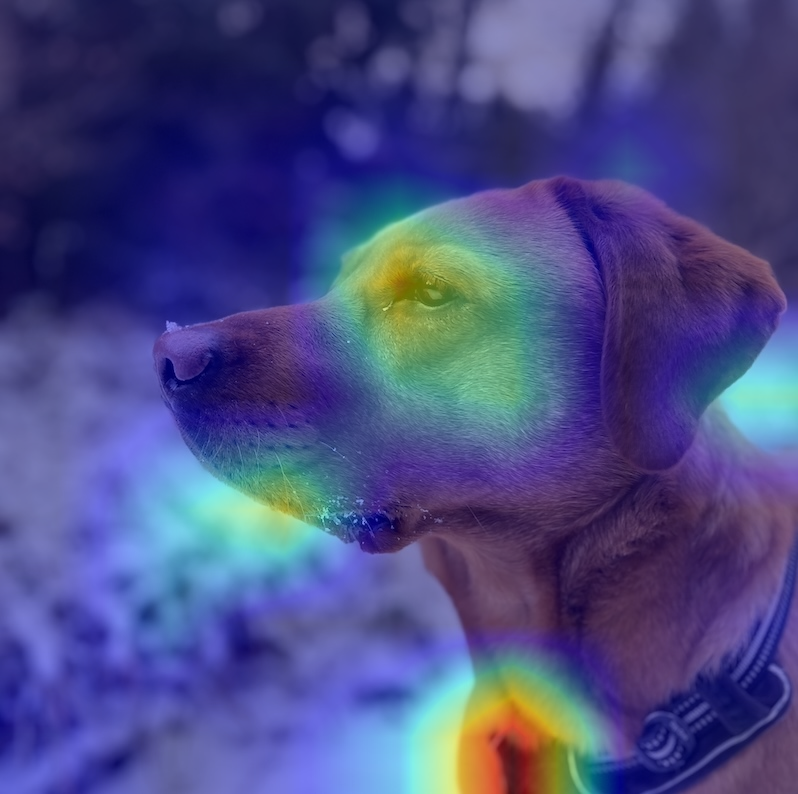
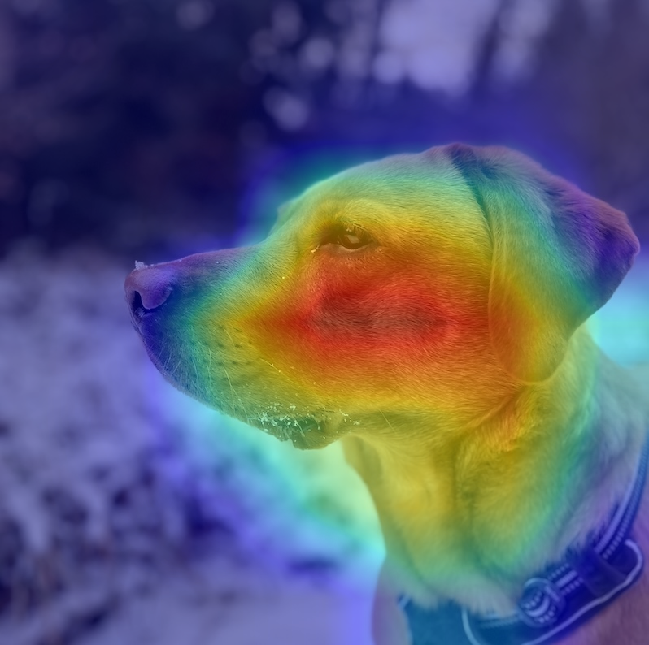

# Grad-CAM XAI Demo

Single-file PyTorch example for learning Grad-CAM on ImageNet-pretrained models with explicit layer selection.

## Why ResNet-50 first

The default model is `resnet50` because Grad-CAM is easier to understand on a mostly linear CNN. `googlenet` is also supported so you can compare how inception branches change the experience.
Dive into the The Basics of ResNet50 here: https://wandb.ai/mostafaibrahim17/ml-articles/reports/The-Basics-of-ResNet50---Vmlldzo2NDkwNDE2

## Environment

Use the project virtualenv:

```bash
source .venv/bin/activate
python --version
```

If you need to install packages into the virtualenv:

```bash
python -m pip install torch torchvision matplotlib pillow numpy
```

## Discover available layers

List exact module names for a model:

```bash
python grad_cam_demo.py --model resnet50 --list-layers
python grad_cam_demo.py --model googlenet --list-layers
```

Good starting points:

- `resnet50`: `layer1.2`, `layer2.3`, `layer4.2`
- `googlenet`: `inception4e.branch4.1.conv`, `inception5a.branch4.1.conv`, `inception5b.branch4.1.conv`

The deeper layers usually produce the most meaningful class-level heatmaps.
For ResNet, prefer whole bottleneck blocks like `layer1.2` over internal modules like
`layer1.2.conv3`. `conv1` often highlights broad edges and textures, while the bottleneck
block output is usually a better class-level Grad-CAM target.

## Run the demo

Use a local dog image:

```bash
python grad_cam_demo.py \
  --image path/to/labrador.jpg \
  --model resnet50 \
  --layers layer1.2 layer2.3 layer4.2 \
  --output-dir outputs/dog_resnet50
```

Optional class override:

```bash
python grad_cam_demo.py \
  --image path/to/labrador.jpg \
  --model googlenet \
  --layers inception5a.branch4.1.conv inception5b.branch4.1.conv \
  --class-idx 207
```

## Outputs

The script saves:

- one overlay image per selected layer
- one comparison grid containing the original image and all overlays

It also prints:

- the target class used for Grad-CAM
- top-5 predictions
- the list of layers that were rendered

## Notes

- Grad-CAM only works on spatial feature maps, so classifier heads and flattened layers are rejected.
- The script contains comments in the relevant sections explaining both what each step does and why it matters for learning.
- See [activation and gradient shape notes](explanation-activation-gradient-shapes.md) for a short explanation of the forward activations and backward gradients printed for ResNet layers.

## Example Outputs

These thumbnails come from the current `outputs/` directory and show how the heatmap changes from shallow texture detectors to deeper class-level features.

### Comparison grid

Full side-by-side output for the current ResNet-50 run.


### Layer thumbnails

`conv1` captures broad edges, contours, and texture at high spatial resolution.



`layer1.0` is the first residual block output, mixing local structure into early object parts.



`layer1.2` is still relatively fine-grained, but starts to suppress background clutter.


`layer2.0` shifts toward larger parts and broader regions of the dog.


`layer2.3` usually balances localization and semantics better than the shallower blocks.


`layer3.0` is deeper and more selective, with less texture-level detail.


`layer3.5` is strongly semantic and tends to emphasize only the most class-relevant regions.


`layer4.0` operates on a very coarse `7x7` map, so the heatmap is blurrier but more class-focused.



`layer4.2` is one of the last ResNet blocks and is often the most interpretable class-level target.


